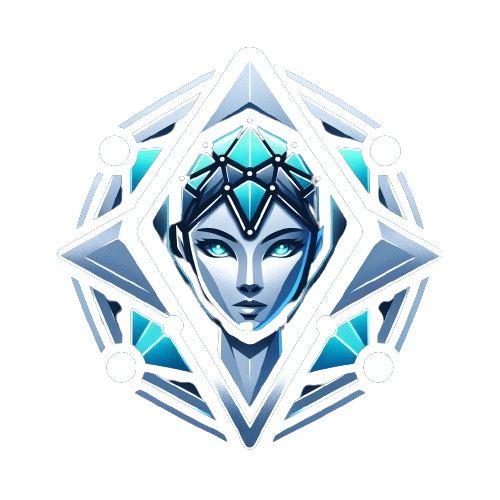

<!-- Improved compatibility of back to top link: See: https://github.com/MistaAsh/Donna/pull/73 -->
<a name="readme-top"></a>

[![Contributors][contributors-shield]][contributors-url]
[![Forks][forks-shield]][forks-url]
[![Stargazers][stars-shield]][stars-url]
[![Issues][issues-shield]][issues-url]
[![MIT License][license-shield]][license-url]
[![LinkedIn][linkedin-shield]][linkedin-url]

<!-- PROJECT LOGO -->
<br />
<div align="center">
  <a href="https://github.com/MistaAsh/Donna">
    
  </a>

  <h3 align="center"> Donna </h3>

  <p align="center">
    Empower Your Crypto Experience with a Personal GenAI-Enabled Assistant
    <br />
    <a href="https://github.com/MistaAsh/Donna"><strong>Explore the docs »</strong></a>
    <br />
    <br />
    <a href="https://github.com/MistaAsh/Donna">View Demo</a>
    ·
    <a href="https://github.com/MistaAsh/Donna/issues">Report Bug</a>
    ·
    <a href="https://github.com/MistaAsh/Donna/issues">Request Feature</a>
  </p>
</div>


<!-- TABLE OF CONTENTS -->
<!-- <details>
  <summary>Table of Contents</summary>
  <ol>
    <li>
      <a href="#about-the-project">About The Project</a>
      <ul>
        <li><a href="#built-with">Built With</a></li>
      </ul>
    </li>
    <li>
      <a href="#getting-started">Getting Started</a>
      <ul>
        <li><a href="#prerequisites">Prerequisites</a></li>
        <li><a href="#installation">Installation</a></li>
      </ul>
    </li>
    <li><a href="#usage">Usage</a></li>
    <li><a href="#roadmap">Roadmap</a></li>
    <li><a href="#contributing">Contributing</a></li>
    <li><a href="#license">License</a></li>
    <li><a href="#contact">Contact</a></li>
    <li><a href="#acknowledgments">Acknowledgments</a></li>
  </ol>
</details> -->


<!-- ABOUT THE PROJECT -->
## About The Project

[![Product Name Screen Shot][product-screenshot]](https://example.com)

Managing cryptocurrency transactions can be a complex and time-consuming task for users, especially when dealing with multiple transactions or various cryptocurrencies. Users often face challenges such as:

* **Complexity of Transactions:** Cryptocurrency transactions involve multiple steps and details, making it challenging for users to perform them seamlessly.

* **Time-Consuming Operations:** Executing multiple transactions manually can be time-consuming and prone to errors, especially for users with busy schedules.

* **Security Concerns:** Users may struggle with maintaining the security of their wallet while actively managing transactions, leading to potential risks.

<p align="right">(<a href="#readme-top">back to top</a>)</p>


### Built With

* [![Next][Next.js]][Next-url]
* [![Tailwind][Tailwind]][Tailwind-url]
* [![Markdown][Markdown]][Markdown-url]
* [![Flask][Flask]][Flask-url]
* [![OpenAI][OpenAI]][OpenAI-url]
* [![Ethereum][Ethereum]][Ethereum-url]
* [![Airstack][Airstack]][Airstack-url]
* [![1inch][1inch]][1inch-url]
* [![Mantle][Mantle]][Mantle-url]

<p align="right">(<a href="#readme-top">back to top</a>)</p>


<!-- GETTING STARTED -->
## Getting Started

The project currently consists of three main components:
* Next.js frontend 
* Flask and OpenAI middleware
* ExpressJS Code Generation server

### Installation
Before we delve into the details of each component, let's first get the project up and running.

To contribute and work on the repository, you need Python and NodeJS installed on your system. If you do not have Python installed, you can install it from [here](https://www.python.org/downloads/). If you do not have NodeJS installed, you can install it from [here](https://nodejs.org/en/download/).

Fork and clone the repository from GitHub.
```bash
git clone https://github.com/MistaAsh/Donna
```
Traverse to the directory where the repository is cloned.
```bash
cd Donna
```

<p align="right">(<a href="#readme-top">back to top</a>)</p>


<!-- USAGE EXAMPLES -->
<!-- ## Usage

Use this space to show useful examples of how a project can be used. Additional screenshots, code examples and demos work well in this space. You may also link to more resources.

_For more examples, please refer to the [Documentation](https://example.com)_

<p align="right">(<a href="#readme-top">back to top</a>)</p> -->


<!-- ROADMAP -->
<!-- ## Roadmap

- [x] Add Changelog
- [x] Add back to top links
- [ ] Add Additional Templates w/ Examples
- [ ] Add "components" document to easily copy & paste sections of the readme
- [ ] Multi-language Support
    - [ ] Chinese
    - [ ] Spanish

See the [open issues](https://github.com/MistaAsh/Donna/issues) for a full list of proposed features (and known issues).

<p align="right">(<a href="#readme-top">back to top</a>)</p> -->


<!-- CONTRIBUTING -->
<!-- ## Contributing

Contributions are what make the open source community such an amazing place to learn, inspire, and create. Any contributions you make are **greatly appreciated**.

If you have a suggestion that would make this better, please fork the repo and create a pull request. You can also simply open an issue with the tag "enhancement".
Don't forget to give the project a star! Thanks again!

1. Fork the Project
2. Create your Feature Branch (`git checkout -b feature/AmazingFeature`)
3. Commit your Changes (`git commit -m 'Add some AmazingFeature'`)
4. Push to the Branch (`git push origin feature/AmazingFeature`)
5. Open a Pull Request

<p align="right">(<a href="#readme-top">back to top</a>)</p> -->


<!-- LICENSE -->
## License

Distributed under the MIT License. See `LICENSE.txt` for more information.

<p align="right">(<a href="#readme-top">back to top</a>)</p>


<!-- CONTACT -->
<!-- ## Contact

Your Name - [@your_twitter](https://twitter.com/your_username) - email@example.com

Project Link: [https://github.com/your_username/repo_name](https://github.com/your_username/repo_name)

<p align="right">(<a href="#readme-top">back to top</a>)</p> -->


<!-- ACKNOWLEDGMENTS -->
## Acknowledgments

* https://github.com/1inch/simple-1inch-proxy
* https://github.com/1inch/fusion-101

<p align="right">(<a href="#readme-top">back to top</a>)</p>


<!-- MARKDOWN LINKS & IMAGES -->
<!-- https://www.markdownguide.org/basic-syntax/#reference-style-links -->
[contributors-shield]: https://img.shields.io/github/contributors/MistaAsh/Donna.svg?style=for-the-badge
[contributors-url]: https://github.com/MistaAsh/Donna/graphs/contributors

[forks-shield]: https://img.shields.io/github/forks/MistaAsh/Donna.svg?style=for-the-badge
[forks-url]: https://github.com/MistaAsh/Donna/network/members

[stars-shield]: https://img.shields.io/github/stars/MistaAsh/Donna.svg?style=for-the-badge
[stars-url]: https://github.com/MistaAsh/Donna/stargazers

[issues-shield]: https://img.shields.io/github/issues/MistaAsh/Donna.svg?style=for-the-badge
[issues-url]: https://github.com/MistaAsh/Donna/issues

[license-shield]: https://img.shields.io/github/license/MistaAsh/Donna.svg?style=for-the-badge
[license-url]: https://github.com/MistaAsh/Donna/blob/master/LICENSE.txt

[linkedin-shield]: https://img.shields.io/badge/-LinkedIn-black.svg?style=for-the-badge&logo=linkedin&colorB=555
[linkedin-url]: https://linkedin.com/in/othneildrew
[product-screenshot]: images/screenshot.png

[Next.js]: https://img.shields.io/badge/next.js-FFD580?style=for-the-badge&logo=nextdotjs&logoColor=white
[Next-url]: https://nextjs.org/

[Tailwind]: https://img.shields.io/badge/Tailwind_CSS-38B2AC?style=for-the-badge&logo=tailwind-css&logoColor=white
[Tailwind-url]: https://tailwindcss.com/

[Markdown]: https://img.shields.io/badge/Markdown-000000?style=for-the-badge&logo=markdown&logoColor=white
[Markdown-url]: https://www.markdownguide.org/

[Flask]: https://img.shields.io/badge/Flask-ADD8E6?style=for-the-badge&logo=flask&logoColor=white
[Flask-url]: https://flask.palletsprojects.com/en/2.0.x/

[OpenAI]: https://img.shields.io/badge/OpenAI-00A67E?style=for-the-badge&logo=openai&logoColor=white
[OpenAI-url]: https://openai.com/

[Ethereum]: https://img.shields.io/badge/Ethereum-3C3C3D?style=for-the-badge&logo=ethereum&logoColor=white
[Ethereum-url]: https://ethereum.org/en/

[Airstack]: https://img.shields.io/badge/Airstack-FF724C?style=for-the-badge&logo=airstack&logoColor=white
[Airstack-url]: https://airstack.com/

[1inch]: https://img.shields.io/badge/1inch-800080?style=for-the-badge&logo=1inch&logoColor=white
[1inch-url]: https://1inch.io/

[Mantle]: https://img.shields.io/badge/Mantle-FFD580?style=for-the-badge&logo=nextdotjs&logoColor=white
[Mantle-url]: https://mantleblockchain.com/
